Singular quadrature in QuadElemList
===================================

A ``QuadElemList`` holds high-order quadrilateral surface patches. Each patch carries an
:math:`N\times N` tensor grid of Gauss–Legendre nodes on the reference square :math:`[0,1]^2`, and the
surface is the order-:math:`N` polynomial interpolant of those nodes,

.. math::

   \mathbf{X}(u,v) = \sum_{i,j} \mathbf{x}_{ij}\, L_i(u) L_j(v),
   \qquad (u,v)\in[0,1]^2 .

A boundary-integral operator needs, for a target :math:`\mathbf{y}` and a patch :math:`E`,

.. math::

   U(\mathbf{y}) = \int_E K(\mathbf{y},\mathbf{x})\,\sigma(\mathbf{x})\,\mathrm{d}S(\mathbf{x}),

assembled as a matrix acting on the patch's nodal density values. When :math:`\mathbf{y}` is far from
:math:`E` a smooth tensor rule suffices. Two cases need special treatment, and each has its own
algorithm:

.. list-table:: Everything else — a target far from the patch relative to its size — takes a plain
   tensor Gauss–Legendre rule and is not discussed here.
   :header-rows: 1
   :widths: 18 41 41

   * -
     - self
     - near
   * - target
     - *on* :math:`E`, at a node :math:`(u_0,v_0)`
     - *off* :math:`E`, at distance :math:`d\ll` patch size
   * - integrand
     - singular, :math:`K\sim 1/r`
     - nearly singular, sharply peaked
   * - scheme
     - Duffy edge-collapse
     - split-at-foot refinement
   * - entry point
     - ``SelfInterac``
     - ``NearInterac``

Both entry points map the runtime element order to a compile-time ``order`` and the runtime
tolerance to a runtime ``digits``; both are independent and may be called in either order.

Self interaction: the Duffy edge-collapse
-----------------------------------------

The target sits *on* the patch, at node :math:`(u_0,v_0)`, so
:math:`r=|\mathbf{X}(u,v)-\mathbf{X}(u_0,v_0)|` vanishes there and :math:`K\sim1/r` is not integrable
by any smooth rule. The Duffy transform removes the singularity through the Jacobian rather than by
refinement.

.. rubric:: Step 1 — split the panel at the target

Join the target to the four corners. This gives four triangles, each with the target as one
vertex and one edge of the square opposite it.

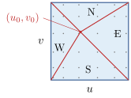

   Step 1. The target is always at a node, never at a corner or edge midpoint, so none of the four
   triangles is degenerate.

.. rubric:: Step 2 — collapse one edge onto the target

Parametrise each triangle by :math:`(s,t)\in[0,1]^2` with

.. math::

   P(s,t) = (u_0,v_0) + s\,\mathbf{c}(t), \qquad \mathbf{c}(t) = (1-t)\,\mathbf{a} + t\,\mathbf{b},

where :math:`\mathbf{a}` and :math:`\mathbf{b}` point from the target to the two ends of the opposite
edge. The line :math:`s=0` collapses the entire :math:`t`-edge onto the target. The Jacobian is

.. math::

   \boxed{\;|\det| = s\,|\mathbf{a}\times\mathbf{b}|\;}

— linear in :math:`s`, and *independent of* :math:`t`.

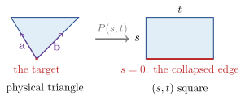

   Step 2. The entire edge :math:`s=0` maps to the single target point.

That single factor of :math:`s` is the whole point. For a kernel of order :math:`1/r`, writing
:math:`\|\cdot\|_G` for the length induced by the surface metric :math:`G` at the target,

.. math::

   K\,|\det| \sim \frac{1}{s\,\|\mathbf{c}(t)\|_G}\cdot s\,|\mathbf{a}\times\mathbf{b}|
             = \frac{|\mathbf{a}\times\mathbf{b}|}{\|\mathbf{c}(t)\|_G},

which is bounded as :math:`s\to0`. The singularity is gone.

.. rubric:: Step 3 — pick the two rules

The :math:`s`-direction is now smooth, so it takes a plain Gauss–Legendre rule with :math:`q_s=N`
nodes. The :math:`t`-direction keeps a residual peak: :math:`1/\|\mathbf{c}(t)\|_G` is largest where
:math:`\mathbf{c}(t)` is shortest, at the foot :math:`t^\ast` of the perpendicular from the target to
the far edge. The peak has height :math:`\sim 1/d` and width :math:`\sim d/L`, where :math:`d` is the
distance to that edge and :math:`L` its length.

Both :math:`t^\ast` and :math:`d/L` are computed in the *surface* metric :math:`G`, not in parameter
space: using parameter distances misplaces the peak by :math:`|\cot\theta|` peak-widths on a sheared
patch. The peak is then resolved by a :math:`\sinh` substitution,

.. math::

   t = t^\ast + \tfrac{d}{L}\sinh\xi ,

with one GL rule of :math:`n_t` points in :math:`\xi`. :math:`n_t` grows with the requested digits and
is larger for vector kernels than scalar ones.

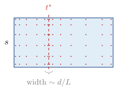

   Step 3. One triangle of the four, :math:`n_s\times n_t` points each.

.. rubric:: Step 4 — contract, evaluate, project

Everything above depends only on :math:`(N,t_i,t_j,\text{triangle})`, so the interpolation operators
are built once per order and cached. The collapse gives them structure: for the S triangle
:math:`v(s,t)=v_0(1-s)` depends on :math:`s` alone, so that factor is a small :math:`(N\times n_s)`
operator rather than :math:`(N \times n_s n_t)`. The evaluation is then a chain of GEMMs:

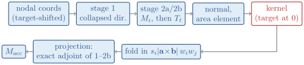

   Step 4. One target, one triangle. Blue boxes are GEMMs against operators cached per
   :math:`(N,\text{digits})`; the kernel sees the target at the origin because the nodal coordinates
   are stored target-shifted.

The projection reuses the same operators in reverse order, so it is the exact adjoint of the
interpolation — which is what keeps the assembled operator consistent. Sources are stored
relative to the target, so the kernel is always evaluated with the target at the origin and
:math:`r` stays accurate near the singularity.

Near interaction: split at the foot
-----------------------------------

Here the target is *off* the patch at a distance :math:`d` that may be far smaller than the patch.
The integrand is smooth but sharply peaked near the closest point, and a single tensor rule would
need impractically many points. The scheme refines — but chooses *where* to refine so that
every operator can be precomputed.

.. rubric:: Step 1 — find the foot

Locate :math:`(u^\ast,v^\ast)` minimising :math:`|\mathbf{X}(u,v)-\mathbf{y}|^2` over :math:`[0,1]^2`:
seed at the nearest nodal point, then Gauss–Newton on the first fundamental form, clamped to the box
with a backtracking line search, falling back to a shrinking grid search if it stalls. Optimality is
tested on the *projected* gradient, since at a box edge the constrained gradient is large — it
balances the constraint — and near-pair feet usually do lie on a shared patch edge.

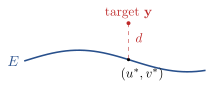

   Near, step 1. The foot is found by Gauss–Newton from the nearest nodal point. :math:`d` may be far
   smaller than the patch, which is what makes the integrand nearly singular.

.. rubric:: Step 2 — split the patch *at* the foot

Cut the parameter square along :math:`u=u^\ast` and :math:`v=v^\ast`, giving four sub-elements. Every
sub-element now has the foot at one *corner*, so refinement always grades toward an *endpoint* of
the sub-element rather than to a point in its interior.

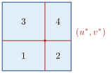

   Near, step 2. With the foot at a corner of every sub-element, refinement grades toward an
   endpoint and the graded intervals depend only on the level — which is what lets the operators
   be tabulated per :math:`N` rather than rebuilt per target.

This is the step that makes the scheme cheap. In *normalised* sub-element coordinates the
graded intervals depend only on the refinement level, never on :math:`(u^\ast,v^\ast)`, so their
interpolation operators are built once per order and looked up. A bisection quadtree, by
contrast, leaves the foot mid-cell and needs a position-dependent operator per leaf — hundreds
of small matrices rebuilt for every target.

.. rubric:: Step 3 — bisect until admissible

Within a sub-element, normalise so the foot is at :math:`x=1`. The graded intervals are

.. math::

   \text{shell}_k = [\,1-2^{-k},\; 1-2^{-(k+1)}\,], \qquad
   \text{core}_k  = [\,1-2^{-k},\; 1\,],

i.e. :math:`\text{core}_k` is the part still touching the foot and :math:`\text{shell}_k` the half
turned away from it.

Splitting at the foot leaves the sub-elements *anisotropic*, so quadrisection would hand that
aspect ratio down to every descendant. Instead the corner cell is bisected along its longer
*physical* dimension only — parameter extent times surface speed — one split at a time,
until that dimension is admissible against the target distance:

.. math::

   b_{\text{ellipse}}\cdot\max(h_u,h_v) \le d .

Each split emits exactly one leaf (the half not touching the corner), and the :math:`u`- and
:math:`v`-levels advance independently.

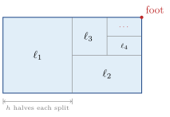

   Near, step 3. The corner cell is split along its longer *physical* dimension (parameter
   extent :math:`\times` surface speed) until :math:`b_{\text{ellipse}}\max(h_u,h_v)\le d`, one leaf
   per split, the :math:`u`- and :math:`v`-levels advancing independently. Roughly ten leaves per
   target at the tolerances used here.

.. rubric:: Step 4 — choose the per-cell order

Each leaf gets a Gauss–Legendre rule whose order comes from the tolerance, via a Bernstein-ellipse
argument evaluated at the *end-foot* reach (the foot lands on a cell endpoint, which is a
weaker requirement than the semi-major reach by :math:`a^2/b^2\approx1.9`).

That test lives in parameter space and cannot see one thing: how skewed the patch is where the
target sits. The required order is flat up to a corner angle of about :math:`120^\circ` and then
grows like :math:`1/(180^\circ-\varphi)` as the corner flattens and the element wraps around the
target. So the order is corrected per (element, target) using :math:`\varphi`, the acute angle
between the surface tangents *at the foot*. An orthogonal parametrisation gives
:math:`\varphi=90^\circ`, a correction factor of :math:`1`, and costs a well-shaped mesh nothing.

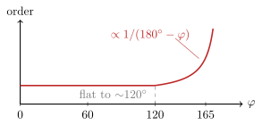

   Near, step 4. Schematic, not measured. :math:`\varphi` is the acute angle between the surface
   tangents at the foot; an orthogonal parametrisation sits at :math:`\varphi=90^\circ` and needs no
   correction.

.. rubric:: Step 5 — integrate each leaf and accumulate

Each sub-element's nodal coordinates are built once per target
(:math:`X_{\text{sub}} = S_u^{\!\top}\,\mathbf{x}\,S_v`), so nothing depending on
:math:`(u^\ast,v^\ast)` survives into the per-cell loop. Every leaf then runs the same
tensor-product block:

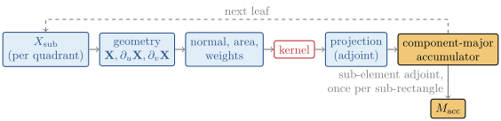

   Near, step 5. :math:`X_{\text{sub}}` is built once per target, so nothing depending on
   :math:`(u^\ast,v^\ast)` enters the loop. The channel-major accumulator lets the projection's
   final GEMM add in place (:math:`\beta=1`).

Cells accumulate into a channel-major buffer so the projection's last GEMM can add in place
(:math:`\beta=1`); a single transpose into the node-major layout at the end replaces a per-cell
sweep.

Numerical results
-----------------

All from ``bench-cubed-sphere``. The convergence runs are at commit cb85cb9 of master; the scaling
run is at 8b37d40, master plus the near-list changes of the ``near-list-scaling`` branch. The surface
is a cubed sphere twisted about :math:`z`.

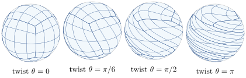

   :math:`4\times4` patches per face; the runs below use :math:`8\times8` and :math:`12\times12`. The
   twist is an *isometry*, so all four panels are the same unit sphere and only the parametrisation
   shears — every difference in the tables below is therefore caused by the parametrisation alone.
   At :math:`\theta=\pi` the patch edges are far from orthogonal, which is where the corner angle
   :math:`\varphi` of step 4 of the near scheme departs from :math:`90^\circ`.

Convergence
~~~~~~~~~~~

Order 12, 12 patches per face (864 elements, 124,416 nodes), tolerances :math:`10^{-3}` to
:math:`10^{-12}`, three twists, Laplace and Stokes, on Rome, Genoa and Icelake with all cores in use.

.. table:: Order 12, 12 patches per face (864 elements, 124,416 nodes), Laplace, single point source
   outside the surface. *error* is :math:`\max|(S[\partial_n u]-D[u])-u|/\max|u|` at the surface nodes;
   *error-density* is the interpolation error of the densities at off-node parameters. Errors from
   Rome; throughput per core with every core of the machine in use.

   +------------------------+------------------+-----------------------------+----------------------------+----------+----------+-----------+
   | kernel, twist          | tol              | error-density               | error                      | pts/s/core, SL setup            |
   |                        |                  |                             |                            +----------+----------+-----------+
   |                        |                  |                             |                            | Rome     | Genoa    | Icelake   |
   +========================+==================+=============================+============================+==========+==========+===========+
   | laplace, :math:`\pi/6` | :math:`10^{-3}`  | :math:`7.2\times10^{-14}`   | :math:`2.1\times10^{-7}`   | 9718     | 20503    | 18357     |
   |                        +------------------+-----------------------------+----------------------------+----------+----------+-----------+
   |                        | :math:`10^{-6}`  | :math:`7.2\times10^{-14}`   | :math:`3.7\times10^{-10}`  | 7340     | 14843    | 12569     |
   |                        +------------------+-----------------------------+----------------------------+----------+----------+-----------+
   |                        | :math:`10^{-9}`  | :math:`7.2\times10^{-14}`   | :math:`2.1\times10^{-13}`  | 4346     | 8987     | 7316      |
   |                        +------------------+-----------------------------+----------------------------+----------+----------+-----------+
   |                        | :math:`10^{-12}` | :math:`7.2\times10^{-14}`   | :math:`1.7\times10^{-13}`  | 2651     | 5257     | 4384      |
   +------------------------+------------------+-----------------------------+----------------------------+----------+----------+-----------+
   | laplace, :math:`\pi/2` | :math:`10^{-3}`  | :math:`4.9\times10^{-11}`   | :math:`6.1\times10^{-7}`   | 8351     | 17980    | 15559     |
   |                        +------------------+-----------------------------+----------------------------+----------+----------+-----------+
   |                        | :math:`10^{-6}`  | :math:`4.9\times10^{-11}`   | :math:`8.5\times10^{-10}`  | 5112     | 10529    | 8733      |
   |                        +------------------+-----------------------------+----------------------------+----------+----------+-----------+
   |                        | :math:`10^{-9}`  | :math:`4.9\times10^{-11}`   | :math:`7.2\times10^{-12}`  | 2461     | 4859     | 4024      |
   |                        +------------------+-----------------------------+----------------------------+----------+----------+-----------+
   |                        | :math:`10^{-12}` | :math:`4.9\times10^{-11}`   | :math:`2.6\times10^{-13}`  | 1321     | 2541     | 2102      |
   +------------------------+------------------+-----------------------------+----------------------------+----------+----------+-----------+
   | laplace, :math:`\pi`   | :math:`10^{-3}`  | :math:`4.3\times10^{-8}`    | :math:`1.2\times10^{-5}`   | 4582     | 9675     | 7976      |
   |                        +------------------+-----------------------------+----------------------------+----------+----------+-----------+
   |                        | :math:`10^{-6}`  | :math:`4.3\times10^{-8}`    | :math:`1.6\times10^{-8}`   | 1870     | 3672     | 3078      |
   |                        +------------------+-----------------------------+----------------------------+----------+----------+-----------+
   |                        | :math:`10^{-9}`  | :math:`4.3\times10^{-8}`    | :math:`1.2\times10^{-10}`  | 605      | 1153     | 996       |
   |                        +------------------+-----------------------------+----------------------------+----------+----------+-----------+
   |                        | :math:`10^{-12}` | :math:`4.3\times10^{-8}`    | :math:`4.7\times10^{-11}`  | 302      | 580      | 499       |
   +------------------------+------------------+-----------------------------+----------------------------+----------+----------+-----------+

Genoa and Icelake match these errors at :math:`10^{-9}` and :math:`10^{-12}` but are up to 43× above
them at :math:`10^{-3}` and :math:`10^{-6}`: ``approx_rsqrt<digits>`` in the kernel picks its Newton
iteration count from the accuracy of the hardware estimate, and AVX-512 takes one iteration fewer
than AVX2 at 4 and 7 digits. All errors stay below the requested tolerance.

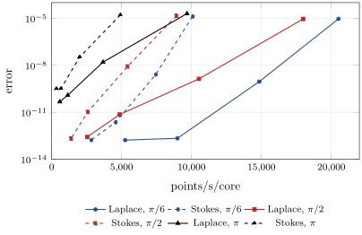

   Error against throughput on Genoa (per core, all 96 cores in use), Laplace solid and Stokes
   dashed, one curve per twist; the four points of a curve are the tolerances :math:`10^{-3}` to
   :math:`10^{-12}`.

- **Convergence**: the error follows the tolerance over nine decades at twist :math:`\pi/6`,
  :math:`2.1\times10^{-7}` to :math:`1.7\times10^{-13}`, down to a floor set by the parametrisation,
  which rises to :math:`4.7\times10^{-11}` at twist :math:`\pi`.
- **Cost of accuracy**: nine decades of tolerance cost 3.9× in throughput (Genoa, :math:`\pi/6`:
  20,500 pts/s/core at :math:`10^{-3}`, 5,300 at :math:`10^{-12}`).
- **Cost of twist**: at :math:`10^{-9}` the rate falls 7.8× from :math:`\pi/6` to :math:`\pi` (8,990 to
  1,150 pts/s/core), as the skewed patches raise the per-cell order and deepen the refinement; at
  :math:`10^{-3}` the factor is 2.1.

OpenMP scaling
~~~~~~~~~~~~~~

Order 12, 8 patches per face (384 elements, 55,296 nodes), twist :math:`\pi/6`, tol :math:`10^{-3}`, on
one Genoa node (AMD EPYC 9474F, :math:`2\times48` cores, AVX-512, ``-march=native``, ``--exclusive``,
``OMP_PLACES=cores``, ``OMP_PROC_BIND=close``). Single-layer setup only; the double layer costs about
the same again. Times are the minimum of 10 runs.

.. table:: *setup* is the wall time of the single-layer self- and near-interaction setup; *speedup* is
   against one thread, with the parallel efficiency in parentheses.

   +-----------+-------------+-----------+-------------+-------------+---------------+
   | kernel    | 1 thread                | 96 threads                | speedup       |
   |           +-------------+-----------+-------------+-------------+               |
   |           | setup (s)   | pts/s     | setup (s)   | pts/s       |               |
   +===========+=============+===========+=============+=============+===============+
   | Laplace   | 2.038       | 27,132    | 0.028       | 1,974,857   | 72.8× (76%)   |
   +-----------+-------------+-----------+-------------+-------------+---------------+
   | Stokes    | 4.044       | 13,674    | 0.058       | 953,379     | 69.7× (73%)   |
   +-----------+-------------+-----------+-------------+-------------+---------------+

- **Single core**: 27,100 pts/s for Laplace and 13,700 for Stokes.
- **Full node**: 1.97 and 0.95 million pts/s on 96 cores, at 76% and 73% parallel efficiency. The
  per-core rate stays within 5% of the single-core value up to 32 threads and is 24% to 27% lower
  at 96.

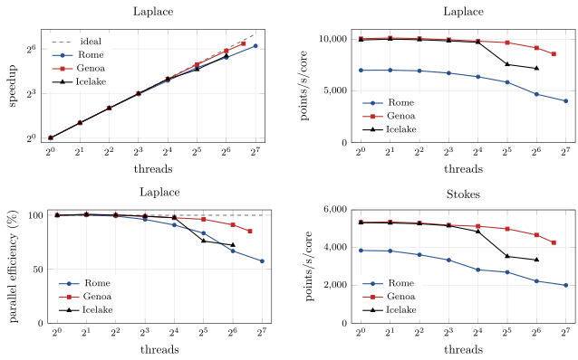

   Per-core throughput of the single-layer setup against thread count; Laplace solid, Stokes dashed.
